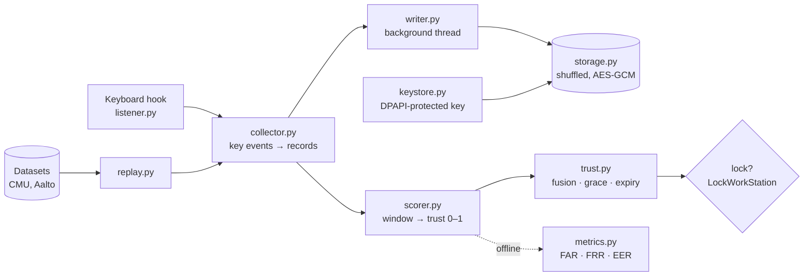

# Doppel.exe

[](https://github.com/abtinmbm/doppel/actions/workflows/tests.yml)

**Continuous authentication for Windows: it learns how you type and locks the screen when someone else is at the keyboard.**

> **Status:** Milestone 1 (typing) in progress. The full pipeline runs live in a dry-run mode; lock thresholds are being tuned on the owner's own collected typing. No accuracy claims are made for the live system yet. Every number below was measured and is labelled with what it measures.

---

## Why

I always leave my PC on at home. Yes, I know about <kbd>Win</kbd> + <kbd>L</kbd>. I even use it, sometimes. The rest of the time, my brother notices.

He doesn't hack anything or guess my password. He just waits until I walk away and helps himself to the logged-in session I left behind. Doppel is my petty, over-engineered way of booting him out: it learns *how I type*, keeps checking the whole time, and when the person at the keyboard stops typing like me it calls Windows' own `LockWorkStation`. (Sorry, bro.)

Windows' built-in protections don't cover this:

| Existing protection | Why it misses |
|---|---|
| Lock after N minutes idle | He sits down within those N minutes |
| Dynamic Lock (locks when your paired phone leaves) | My phone is still on the desk |

### The bigger problem

My brother is just the catalyst. A login screen checks who you are **once**; everything after that assumes nobody else sits down. The same gap exists wherever a session stays open: shared offices, hospital workstations, labs, a laptop left open in a library. **Continuous authentication** closes it by checking identity the whole time, from behaviour, without asking the user to do anything. Doppel is a small, local, privacy-preserving version of that idea, built to be measured and attacked honestly.

## How it works



1. **Collect.** A keyboard hook timestamps every key press and release. For each pair of consecutive keys the collector records three times: **hold** (how long the first key is down), **DD** (press to next press) and **UD** (release to next press; negative when keys overlap). It handles auto-repeat, overlapping keys, Shift/Ctrl (keys are identified by virtual key code) and releases lost when the screen locks.
2. **Label without content.** Each pair gets a coarse label instead of its letters: keyboard geometry for two letters (`(same_half, distance_bucket)`), or the kind of each key otherwise (`("right", "space")`). Which label to use was decided by experiment (see Results).
3. **Store encrypted.** Records are buffered in batches of 200, shuffled, and encrypted with AES-GCM on a background thread; the key is protected by Windows DPAPI.
4. **Score.** The owner's profile is the median and spread of each timing per label group, measured on a log scale (differences are proportional). A window of 100 records is scored by summing each group's signed, scaled deviations, each capped so a single long pause cannot dominate: random noise cancels, a consistent shift (a different person) adds up.
5. **Calibrate.** The window score becomes a trust value from 0 to 1: the share of the owner's own held-out windows that looked at least as unusual. Every signal is calibrated this way, so future signals (mouse) fuse on the same scale.
6. **Decide.** The trust engine locks after several low values in a row (grace). After a quiet period with no evidence, old evidence expires and the first low value locks: someone sitting down after you left must look like you straight away.

The same collector processes live keystrokes and dataset rows, so experiments evaluate exactly the records the live app stores.

## Privacy design

Doppel must not become a keylogger. These rules are enforced in code:

- **No letters are ever stored.** A record is a label and three timings, for example `[false, 2, 122.0, 35.0, -87.0]` or `["right", "space", 76.5, 93.0, 16.5]`. Key identities exist only in memory while a key is held.
- **Typing order is destroyed.** Each batch of 200 records is shuffled with the OS's cryptographic random generator before encryption, so word lengths cannot be read from label sequences.
- **Encrypted at rest.** AES-GCM with a fresh nonce per batch; the only plaintext is the day, bound to the ciphertext as associated data so editing it is detected. AES-GCM was chosen over Fernet because Fernet tokens contain a plaintext timestamp.
- **Key never on disk in plain form.** It is protected with Windows DPAPI, tied to the owner's Windows login.
- **Local only.** No network calls.
- **Other people's data only with consent**, kept in separate test databases, never mixed into the owner's profile.

## Threat model

| Attacker | Has | Doppel's response |
|---|---|---|
| My brother (or anyone) at the unlocked PC | The live session | Detect and lock (key metrics: keystrokes-until-lock, false locks per day) |
| Thief with the laptop or a copy of the files | Files only | AES-GCM + DPAPI-protected key |
| Malware running as the owner | Everything the owner has | Out of scope (it could log keys directly) |

**Known gaps:** someone at the session can end the process; reading or scrolling without typing is invisible to a typing signal (evidence expiry mitigates, a mouse signal is planned); anything done before the lock gets through; the DPAPI key can become unrecoverable after an administrator password reset.

## Results so far

All numbers below are measured with the scripts named. Dataset results compare *methods*; they are not Doppel's accuracy on a real laptop.

### 1. The evaluation code reproduces a published benchmark

Before trusting any number, the EER code was checked against the CMU Keystroke Dynamics Benchmark (Killourhy & Maxion, 2009), using the paper's protocol (train on each subject's first 200 repetitions, test on the last 200, impostors = the first 5 of each other subject). `scripts/cmu_benchmark.py`:

| Detector | Doppel mean EER (sd) | Published mean EER (sd) |
|---|---|---|
| Scaled Manhattan | 0.0960 (0.0694) | 0.0962 (0.0694) |
| Manhattan | 0.1529 (0.0926) | 0.1529 (0.0925) |
| Euclidean | 0.1705 (0.0951) | 0.1706 (0.0952) |

### 2. A privacy-preserving label beats storing the real letters

On 1,000 participants of the Aalto 136M Keystrokes free-text dataset (time-ordered split: sentences 1–10 train, 11–15 test; 50 impostors per owner), mean EER for windows of 100 records. `scripts/aalto_experiment.py`:

| Label scheme | Stores letters? | EER |
|---|---|---|
| No label | no | 0.300 |
| Geometry only | no | 0.241 |
| Real letter pairs (digraphs) | **yes** | 0.212 |
| **Geometry + key kinds (chosen)** | **no** | **0.173** |

Paired over the same owners, geometry + key kinds beat geometry by 0.068 EER (95% interval 0.062–0.075). Storing real letter pairs splits Space/Shift pairs into groups too small to learn from; key kinds keep them in a few well-filled groups.

The window score itself was also chosen by measurement: summing signed deviations per group instead of averaging absolute deviations improved EER from 0.207 to 0.176 (digraph labels, 100 participants). The label choice was re-checked with the improved scorer below and still holds: geometry + key kinds 0.025, real letter pairs 0.046, geometry only 0.051.

### 3. Fixing outliers cut the error about 7×

`scripts/model_experiment.py` compared 12 scoring variants on 500 owners (50 impostors each). Thinking pauses inside DD were swamping whole windows; measuring timings on a log scale and capping each deviation at ±3 fixed it. The winner was chosen on a development sample and then confirmed once on 500 different owners:

| Scorer | Development sample | Fresh confirmation sample |
|---|---|---|
| Previous (raw timings, no cap) | 0.173 | 0.164 |
| **Log scale + capped deviations** | **0.026** | **0.023** |

Mean EER for windows of 100 records. A likelihood ratio against a separate background population was also tried (0.043) and not adopted.

### 4. The lock decision, simulated

`scripts/lock_simulation.py` builds a real scorer and trust engine for 498 Aalto owners (10 impostors each). With windows of 100 records, a threshold of 0.05 and grace 3, the improved scorer locks out **90%** of impostors at their first window after a quiet period (78% before), at **1.99 false locks per 1,000 owner keystrokes** (2.38 before).

Trust is a calibrated p-value, so the threshold sets the false-lock rate and a stronger scorer is what allows a lower threshold. Aalto's small calibration sets cannot reach thresholds low enough for daily use; they are tuned on the owner's own, much larger data against a target of **at most one false lock per day**.

### 5. Engineering measurements

- Encrypting and writing one 200-record batch: median 2.29–2.45 ms (`scripts/flush_timing.py`), done on a background thread so the keyboard hook is never delayed.
- Computing one trust value: median 0.25 ms, worst 1.41 ms (96 values), also off the hook thread.

## Running it

**Requirements:** Windows 10/11, Python 3.12, [uv](https://docs.astral.sh/uv/).

```powershell
git clone https://github.com/abtinmbm/doppel
cd doppel
uv sync
```

Windows Smart App Control blocks unsigned `.exe` launchers (including the one uv creates), so everything runs as Python modules from the repository root:

```powershell
# Watch the records your typing produces (Esc stops)
uv run python -m doppel.listener

# Collect your typing into the encrypted database (Ctrl+C in this window stops)
uv run python -m doppel.listener --store --quiet
uv run python scripts/db_summary.py          # aggregates only, never a record

# Live app, dry run: prints trust values and WOULD LOCK, never locks
uv run python -m doppel.app

# Real locking (only after tuning)
uv run python -m doppel.app --lock
```

**Datasets** (not included; place them under `data/`, which is git-ignored):

| Dataset | Save as | Used by |
|---|---|---|
| [CMU Keystroke Dynamics Benchmark](https://www.cs.cmu.edu/~keystroke/) | `data/cmu/DSL-StrongPasswordData.csv` | `scripts/cmu_benchmark.py` |
| [Aalto 136M Keystrokes](https://userinterfaces.aalto.fi/136Mkeystrokes/) | `data/aalto/Keystrokes.zip` (do not unzip) | `scripts/aalto_experiment.py`, `scripts/lock_simulation.py` |

## Testing

Every module has an assert-based check whose expected values were worked out by hand before running the code (`scripts/*_test.py`, 15 scripts). Key checks were also verified by breaking the code on purpose and confirming the check fails. Each script runs on its own (`uv run python scripts/collector_test.py`), and pytest runs them all, locally and on every push via GitHub Actions on Windows:

```powershell
uv run pytest
```

Scripts that hook the real keyboard are named `scripts/*_demo.py` and are never collected.

Beyond unit tests: reproduction of a published benchmark (above) and live runs where known text is typed and every record is matched to the keys pressed.

## Project layout

| Path | Contents |
|---|---|
| `src/doppel/` | The package: `keymap`, `records`, `collector`, `listener`, `keystore`, `storage`, `writer`, `metrics`, `detectors`, `replay`, `window_scorer`, `aalto`, `scorer`, `trust`, `app` |
| `scripts/` | Tests (`*_test.py`, safe to run anywhere), benchmarks, experiments, and early live demos (`*_demo.py`, which hook the real keyboard) |
| `docs/devlog.md` | Session log: what was built, what broke and how it was fixed, decisions |

Each module starts with a "How it works" section explaining its algorithm step by step.

## Limitations

- One owner, one machine so far; accuracy claims rest on public datasets and consenting impostors.
- Dataset results (browser timing at 1 ms, typed in one sitting) are likely optimistic compared with real use across days and keyboards.
- Thresholds are not yet tuned on owner data; the dry run shows the mechanism, not final accuracy.
- Keyboard geometry assumes a QWERTY layout.
- A typing signal cannot see someone who only reads or scrolls.
- **Profile poisoning is limited, not solved.** The live app quarantines new typing and stores it only if every window that judged it matched the owner; on 198 Aalto owners this let 11.2% of impostor typing through at keep threshold 0.05 and 1.9% at 0.2, while keeping 53.2% and 43.2% of owners' typing. Typing the detector cannot tell apart from the owner's still gets through.

## Roadmap

1. **Typing, end to end** (in progress): collector ✓, evaluation validated on CMU ✓, label chosen on Aalto ✓, encrypted collection ✓, trust engine and dry-run app ✓, tuning on owner data, real locking.
2. **Writing style** (offline only): can a model tell the owner apart from an LLM imitating them?
3. **Attacks:** imitation by a person, replay and synthetic timings, LLM style mimicry, killing the app; defenses (such as detecting injected keystrokes) and their measured effect.
4. **Mouse / trackpad** as a second signal fused into the same trust score.

## References

- K. Killourhy and R. Maxion. *Comparing Anomaly-Detection Algorithms for Keystroke Dynamics.* DSN 2009. Dataset: [CMU Keystroke Dynamics Benchmark](https://www.cs.cmu.edu/~keystroke/).
- V. Dhakal, A. M. Feit, P. O. Kristensson and A. Oulasvirta. *Observations on Typing from 136 Million Keystrokes.* CHI 2018. [doi:10.1145/3173574.3174220](https://doi.org/10.1145/3173574.3174220). Dataset: [Aalto 136M Keystrokes](https://userinterfaces.aalto.fi/136Mkeystrokes/) (non-commercial use with attribution).

## License

[MIT](LICENSE). The datasets are not included and keep their own terms (Aalto: non-commercial use with attribution).
